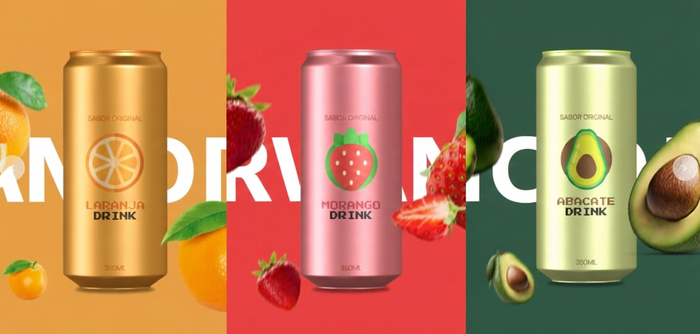

# 🍊 Slider de Bebidas Animado

Projeto Front-End de um slider interativo de bebidas, onde cada item possui animações dinâmicas de entrada e saída ao trocar de bebida ou recarregar a página.

## 🖥️ Demonstração
🔗 Site online: https://soda-bay.vercel.app/  
🔗 Repositório: https://github.com/mellacer/Soda

## 📸 Preview


## 🛠️ Tecnologias Utilizadas
- HTML5
- CSS3
- JavaScript

## ⚙️ Funcionalidades
- Navegação entre bebidas utilizando botões laterais
- Animação de entrada e saída dos elementos
- Transições suaves ao mudar de bebida
- Animação executada ao recarregar a página
- Layout moderno e visualmente atrativo

## 📚 Objetivo do Projeto
Projeto desenvolvido com fins educacionais, com o objetivo de praticar:
- Manipulação do DOM com JavaScript
- Controle de estados de um slider
- Animações e transições com CSS
- Integração entre HTML, CSS e JavaScript
- Organização visual e experiência do usuário

## 📱 Responsividade
O layout foi adaptado para diferentes tamanhos de tela, mantendo a animação e a navegação funcionais em dispositivos mobile.

## 🚀 Como executar o projeto
```bash
# Clone o repositório
git clone https://github.com/mellacer/Soda

# Acesse a pasta do projeto
cd Soda

# Abra o arquivo index.html no navegador
